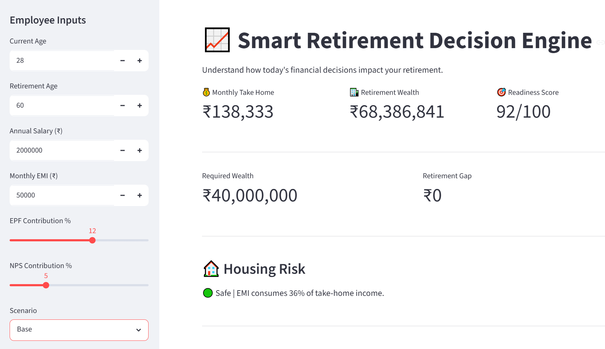
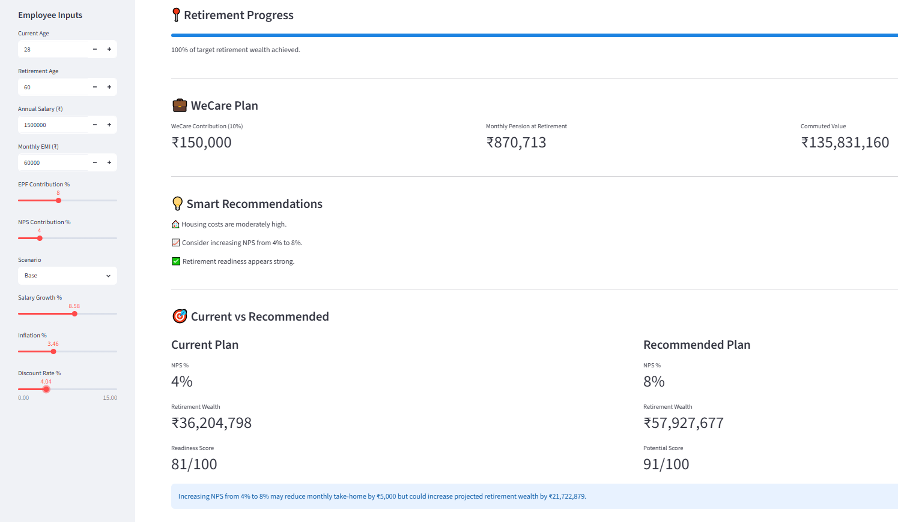
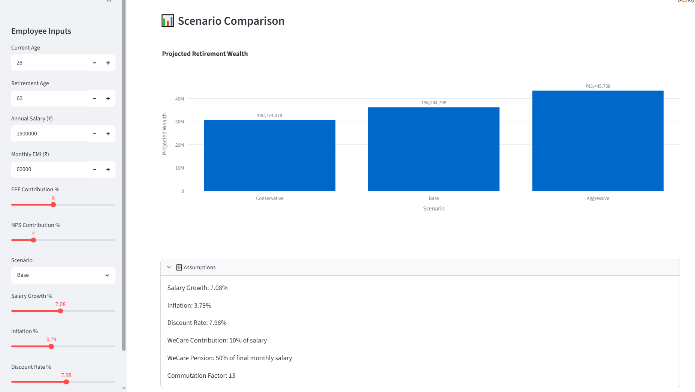

# 📈 Smart Retirement Decision Engine

An interactive retirement decision-support application built using **Python** and **Streamlit** to help employees evaluate how today's financial decisions impact long-term retirement outcomes.

This project was developed as part of a retirement and financial wellness case study, combining actuarial thinking with data-driven decision support.

---

# 🌐 Live Demo

🚀 **Try the application here:**

https://smart-retirement-decision-engine.streamlit.app/

---

## 🎯 Project Objective

The application helps employees understand the trade-off between present-day spending and future retirement security by analysing:

- 💰 Current Take-Home Salary
- 🏦 Retirement Wealth
- 🏠 Housing Affordability
- 📈 EPF & NPS Contributions
- 💼 WeCare Pension Benefits

Rather than simply calculating retirement wealth, the application provides an interactive decision-support tool that enables users to compare different retirement strategies and understand the long-term impact of financial decisions.

---

## ✨ Key Features

- Interactive employee input dashboard
- Retirement wealth projection
- Retirement readiness score
- Monthly take-home salary calculation
- Housing affordability assessment
- WeCare pension estimation
- Current vs Recommended retirement strategy
- Conservative, Base and Aggressive scenario comparison
- Smart financial recommendations
- Interactive charts and visualisations

---

## 🧮 Actuarial Concepts Applied

This project demonstrates practical actuarial and financial modelling concepts including:

- Retirement planning
- Pension modelling
- Long-term wealth accumulation
- Contribution analysis
- Scenario analysis
- Employee benefits
- Financial decision support
- Retirement readiness assessment

---

## 🛠️ Technology Stack

- Python
- Streamlit
- Pandas
- Plotly

---

# 📸 Application Preview

## Dashboard

---

## Smart Recommendations

---

## Scenario Analysis

---

## 🚀 Future Enhancements

Potential future improvements include:

- Inflation-adjusted retirement projections
- Dynamic salary growth modelling
- Monte Carlo simulation
- Tax optimisation analysis
- AI-powered retirement coaching
- Portfolio allocation recommendations
- Exportable retirement reports (PDF)

---

## 👨‍💻 Author

**Harshal Jain**

Actuarial Student | Python | Financial Modelling | Retirement Analytics

LinkedIn:
https://www.linkedin.com/in/harshaljainactuaries/

---

## ⭐ Repository Purpose

This repository showcases how actuarial principles, financial modelling and Python can be combined to develop an interactive retirement planning application. The project demonstrates practical problem-solving, data visualisation and decision-support capabilities relevant to actuarial, insurance and financial analytics roles.

---

## 📄 License

This project is licensed under the MIT License.
